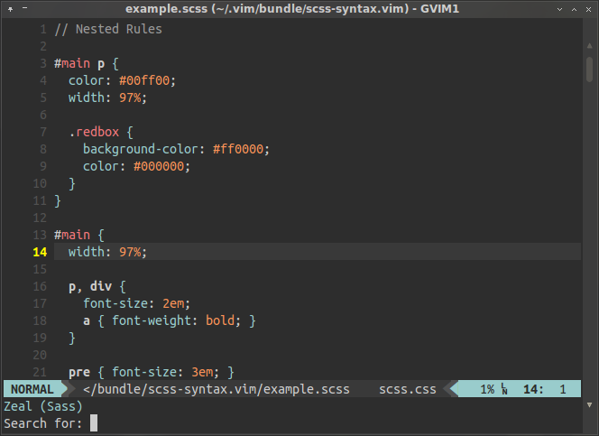
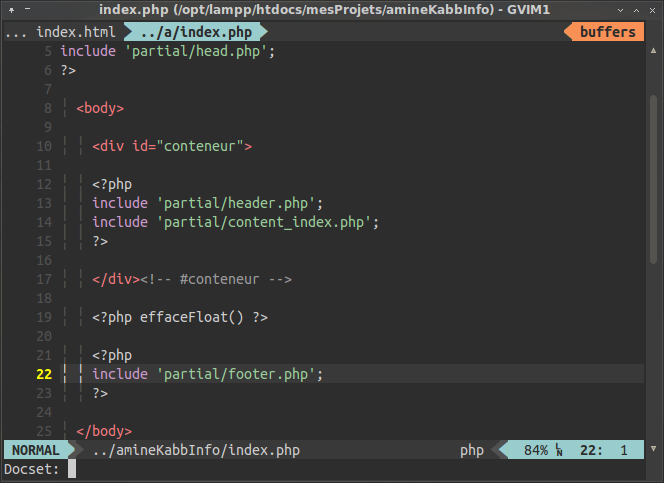

Zeavim - Zeal pour Vim
=====================

Description
-------------

Zeavim permet d'utiliser le navigateur de documentations [Zeal](http://zealdocs.org) directement &agrave; partir de [Vim](http://vim.org).

Cette extension a &eacute;t&eacute; test&eacute;e sur GNU/Linux et Windows.

Vous pouvez trouver ce README en [anglais](../README.md).

Installation
-------------

Pour utiliser zeavim, vous devrez avoir Zeal install&eacute; bien s&ucirc;r. T&eacute;l&eacute;chargez-le d'[ici](http://zealdocs.org/download.html) puis installez-le.

### Installation manuelle

Copiez les fichiers t&eacute;l&eacute;charg&eacute;s dans le dossier de configuration de vim, qui se trouve par d&eacute;faut dans `~/.vim/`, ou `$HOME/vimfiles` pour Windows.

### En utilisant Pathogen
Si vous utilisez Pathogen, il suffit d'extraire le contenu de l'archive dans le dossier `bundle`.

### En utilisant Vundle
Il suffit d'ajouter la ligne ci-dessous dans la partie relative &agrave; Vundle de votre vimrc.

	Plugin 'KabbAmine/zeavim.vim'

Puis proc&eacute;dez &agrave; l'installation de l'extension avec la ligne de commande suivante:

	:PluginInstall

Utilisation
-----------

Il y a 4 moyens d'utiliser zeavim:

1.	`<leader>z` - Pour ex&eacute;cuter Zeal avec le mot courant (Sous le curseur) en tant que mot-cl&eacute; et le type de fichier (Ou extension parfois) comme nom de docset (Mode NORMAL).
2.	`<leader>z` - Pour ex&eacute;cuter Zeal avec la sélection visuelle courante (Sous le curseur) en tant que mot-cl&eacute; et le type de fichier (Ou extension parfois) comme nom de docset (Mode VISUEL).
3.	`<leader>Z` (Notez le z majuscule) - Pour utiliser le type de fichier en tant que docset et la possibilit&eacute; de sp&eacute;cifier le mot-cl&eacute; manuellement.

	

4.	`<leader><leader>z` - Pour sp&eacute;cifier le mot-cl&eacute; et le docset manuellement.

	

Raccourcis clavier
------------------

Vous pouvez facilement changer les raccourcis claviers de zeavim:

-	Pour `<leader>z` (Mode NORMAL)

		nmap NOUVEAU_RACCOURCI <Plug>ZVCall

-	Pour `<leader>z` (Mode VISUEL)

		nmap NOUVEAU_RACCOURCI <Plug>ZVVisualSelecCall

-	Pour `<leader>Z`

		nmap NOUVEAU_RACCOURCI <Plug>ZVKeyCall

-	Pour `<leader><leader>z`

		nmap NOUVEAU_RACCOURCI <Plug>ZVKeyDoc

Ou vous pouvez, d'une mani&egrave;re globale, changer la touche `<leader>` de Vim (Qui est `/` par d&eacute;faut) en ajoutant dans votre vimrc:

	let mapleader="NOUVELLE_TOUCHE_LEADER"

Personnalisation
----------------

### Emplacement de Zeal

Par d&eacute;faut, zeavim suppose que *zeal* se trouve dans `%ProgramFiles/Zeal/zeal.exe` pour Windows et `/usr/bin/zeal` pour les syst&egrave;mes UNIX.
Vous pouvez sp&eacute;cifier manuellement l'emplacement de Zeal en ajoutant dans votre vimrc:

	if has('win32') || has('win64')
		let g:ZV_zeal_directory = " chemin\\de\\zeal.exe\""
	else
		let g:ZV_zeal_directory = "/usr/bin/zeal"
	endif

### Ajouter des types de fichiers

Zeavim g&eacute;n&egrave;re le nom du docset &agrave; partir de l'option de vim 'filetype' (Ou &agrave; partir de l'extension) du fichier courant, mais si vous avez besoin d'ajouter d'autres types de fichiers, vous pouvez cr&eacute;er dans votre vimrc un dictionnaire ayant comme cl&eacute; l'extension ou le type de fichier (Option 'filetype'), et le nom du docset comme valeur.

	let g:ZV_added_files_type = {
				\ 'EXTENSION': 'NOM_DU_DOCSET',
				\ 'TYPE_DU_FICHIER': 'NOM_DU_DOCSET',
				\ }

Par exemple (Ces types de fichiers sont d&eacute;j&agrave; inclus dans zeavim)

	let g:ZV_added_files_type = {
				\ 'cpp': 'C++',
				\ 'js': 'Javascript',
				\ 'md': 'Markdown',
				\ 'mdown': 'Markdown',
				\ 'mkd': 'Markdown',
				\ 'scss': 'Sass',
				\ }

Notes
-----

Zeavim est ma 1&egrave;re extension de Vim et elle a &eacute;t&eacute; au d&eacute;part cr&eacute;&eacute;e pour une utilisation personnelle, alors n'h&eacute;sitez pas &agrave; reporter les bugs et &agrave; me contacter s'il le faut, je r&eacute;pond habituellement au bout de 1-2 jours.

Merci &agrave; [Jerzy Kozera](https://github.com/jkozera) d'avoir cr&eacute;&eacute; une application open-source aussi utile.

Merci &agrave; Bram Moolenaar d'avoir d&eacute;velopp&eacute; l'application la (plus) parfaite du monde :D

Merci &agrave; vous si vous utilisez zeavim.
