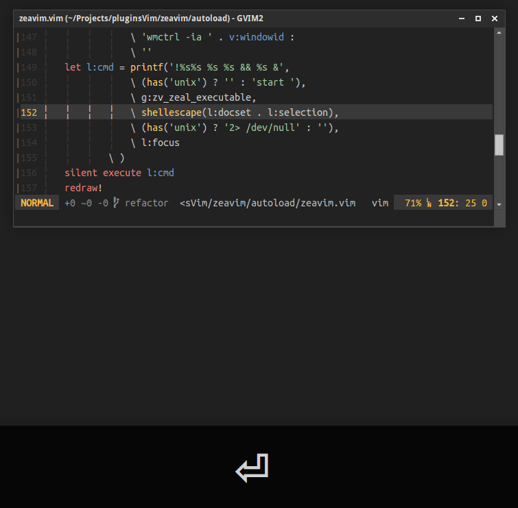

Zeavim, <small>Zeal for Vim</small>
===============================================================================================================================================


[Description](#description) | [Installation](#description) | [Usage](#usage) | [Mapping](#mapping) | [Commands](#commands) | [Customization](#customization) | [Notes](#notes)

-------

**:warning: STARTING FROM VERSION `2.2.0` ALL THE KEYS OF `g:zv_file_types` ARE CONSIDERED AS REGEX AND VIM MAGIC IS NOT APPLIED BY DEFAULT, SO PLEASE UPDATE YOUR CONFIGURATION:**

e.g

```vim
" CHANGE THIS
let g:zv_file_types = {
    \	'(ft1|ft2)' : 'foobar',
    \ }

" TO THIS
let g:zv_file_types = {
    \	'\v(ft1|ft2)' : 'foobar',
    \ }
" OR THIS
let g:zv_file_types = {
    \	'\(ft1\|ft2\)' : 'foobar',
    \ }
```

-------

Description <a id="description"></a>
-------------

Zeavim allows to use the offline documentation browser [Zeal](http://zealdocs.org) from Vim.



### Features

- Search for word under cursor, a text motion or a visual selection.
- Search without losing focus from Vim if Zeal is already opened (Need wmctrl on UNIX).
- Narrow search with a docset or a query.
- Allows using multiple docsets.
- Docset name completion.
- Define you own docsets using patterns.
- Works on GNU/Linux and Windows.

Installation <a id="installation"></a>
-------------

To use zeavim, you need of course to have Zeal installed. Grab it from [here](http://zealdocs.org/download.html) and install it .

### Manual installation

Install the distributed files into Vim runtime directory which is usually `~/.vim/`, or `$HOME/vimfiles` on Windows.

### Using a plugin manager

And this is the best way, use a vim plugin manager.  
Here an example with [Vim-plug](https://github.com/junegunn/vim-plug) and its lazy loading functionnality:

```vim
Plug 'KabbAmine/zeavim.vim', {'on': [
			\	'Zeavim', 'Docset',
			\	'<Plug>Zeavim',
			\	'<Plug>ZVVisSelection',
			\	'<Plug>ZVKeyDocset',
			\	'<Plug>ZVMotion'
			\ ]}
```

Usage <a id="usage"></a>
-----

There are 3 ways of using zeavim:

1. `<leader>z` or `:Zeavim`

	Search for word under cursor (Or visual selection) with the docset defined automatically<sup><a href="#plus">+</a></sup>.

2. `gz{motion}`

	Search for a motion with the docset defined automatically<sup><a href="#plus">+</a></sup>.

3. `<leader><leader>z` or `:Zeavim!`

	Narrow search with a docset<sup><a href="#plus">+</a></sup> and a query (A default docset is provided).
	
	
	
	- Multiple docsets can be defined, just separate them by a comma.
	- The docset name can be completed using `tab`, see [completion](#completion) for that.

Mapping <a id="mapping"></a>
-------

You can easily change the mapping keys of zeavim:

```vim
nmap gzz <Plug>Zeavim           " <leader>z (NORMAL mode)
vmap gzz <Plug>ZVVisSelection   " <leader>z (VISUAL mode)
nmap gz <Plug>ZVMotion          " gz{motion} (NORMAL mode)
nmap gZ <Plug>ZVKeyDocset       " <leader><leader>z
```

You can [disable the default mappings](#disableMappings), but this is useful only if you're not going to use all the `<Plug>`'s above.

Commands <a id="commands"></a>
-------

### Main commands

A unique command `Zeavim` is provided.

```vim
:Zeavim     " NORMAL & VISUAL modes
:Zeavim!    " Ask for docset & query
```

**N.B:** The commands `ZvV` and `ZVKeyDocset` are still available to maintain compatibility with old versions.

### Specify manually a docset

If you need a lazy way to specify a docset, you can use:

```vim
Docset DOCSET_NAME
```

As an example, I'm working on a `scss` file but I want to get `compass` documentation when using Zeavim, so I just need to specify manually this docset:

```vim
Docset compass
```

Then Zeavim **only for the current buffer** will use `compass` as a docset.
Note that you can define multiple docsets here.

The docset name can be completed, for that see [completion](#completion).

To set back the initial docset, a simple `Docset` without argument is enough.


Customization <a id="customization"></a>
-------------

### Location of Zeal

By default zeavim looks for an executable named `zeal` on your PATH for UNIX and in `%ProgramFiles%/Zeal/zeal.exe` for Windows.
You can specify Zeal's location manually by adding in your vimrc:

```vim
let g:zv_zeal_executable = 'path/to/zeal'
```

Or if you're using both OS:

```vim
let g:zv_zeal_executable = has('win32') ?
			\ 'path/to/zeal.exe' :
			\ 'path/to/zeal'
```

### Arguments for Zeal

You can add arguments/flags to zeal command using `g:zv_zeal_args`.

### Add file types

By default, the plugin defines a few docsets:

```vim
'scss': 'sass'
'sh'  : 'bash'
'tex' : 'latex'
```

Its up to you to add patterns (Or overwrite the default ones).  
For that you can use `g:zv_file_types` variable.  
It's a dictionary where:

* The keys are pattern(s) that can match file names, file types or file extensions.
* The values are the docset names.

```vim
" For the docset, not mandatory but you can use underscores instead of spaces
let g:zv_file_types = {
    \	'FILE_NAME' : 'DOCSET_NAME',
    \	'EXTENSION' : 'DOCSET NAME',
    \	'FILE_TYPE' : 'DOCSET_NAME',
    \ }
```

Here again you can define multiple docsets for a type, just separate them by a comma.

```vim
'TYPE': 'DOCSET1,DOCSET2'
```

Note that you are using regex, so it can be a more accurate pattern:  

e.g

```vim
let g:zv_file_types = {
			\	'css'                      : 'css,foundation,bootstrap_4',
			\	'.htaccess'                : 'apache_http_server',
			\	'\v^(G|g)runt\.'           : 'gulp,javascript,nodejs',
			\	'\v^(G|g)ulpfile\.'        : 'grunt',
			\	'\v^(md|mdown|mkd|mkdn)$'  : 'markdown',
			\ }
```

### Disable default mappings <a id="disableMappings"></a>

You can disable the default mappings:

```vim
let g:zv_disable_mapping = 1
```

If you're using all the functionalities of the plugin (NORMAL, VISUAL, docset and query manual input), no need of setting this variable, just *map* the `<Plug>`'s normally.

### Order and criteria of defining docset <a id="plus"></a>

To define the docset, the plugin uses by order:

* The value defined by `:Docset` command.
* The values defined in `g:zv_get_docset_by`.
* The current file type.

The default value of `g:zv_get_docset_by` is `['file', 'ext', 'ft']`.  
That means that the plugin will try to find a pattern matching:

1. The current file name
2. The current file extension
3. The current file type

You can set a specific order or remove a criteria:

```vim
" Find matching pattern to the file type only:
let g:zv_get_docset_by = ['ft']

" Find matching pattern to the extension first, then to the file name 
" and finally to the type.
let g:zv_get_docset_by = ['ext', 'file', 'ft']
```

### Docset name completion <a id="completion"></a>

When using `<leader><leader>z` or the command `Docset`, you can get a docset name completion with `Tab`.
The docset names are taken from your zeal's docset directory (The one specified in Zeal's options).

By default zeavim assumes that Zeal docsets are located in `%LOCALAPPDATA%\Local\Zeal\Zeal\docsets`, which expands into something like `C:\Users\you\AppData\Local\Zeal\Zeal\docsets` for Windows and `~/.local/share/Zeal/Zeal/docsets` for UNIX systems.

If you have them in a different folder, just set the correct path in `g:zv_docsets_dir` variable.

e.g

```vim
let g:zv_docsets_dir = has('win32') ?
			\ 'path/to/docsets/in/win' :
			\ 'path/to/docsets/in/unix'
```

My configuration
----------------

```vim
nmap gzz <Plug>Zeavim
vmap gzz <Plug>ZVVisSelection
nmap gZ <Plug>ZVKeyDocset<CR>
nmap gz <Plug>ZVMotion
nmap <leader>z <Plug>ZVKeyDocset
let g:zv_file_types = {
			\	'help'               : 'vim',
			\	'.htaccess'          : 'apache http server',
			\	'javascript'         : 'javascript,nodejs',
			\	'python'             : 'python 3',
			\	'\v^(G|g)ulpfile\.'  : 'gulp,javascript,nodejs',
			\ }
let g:zv_zeal_args = g:hasUnix ? '--style=gtk+' : ''
let g:zv_docsets_dir = g:hasUnix ?
			\ '~/Important!/docsets_Zeal/' :
			\ 'Z:/username/Important!/docsets_Zeal/'
```

Notes <a id="notes"></a>
-----

Zeavim was my first vim plugin and it was created in the beginning for a personal use, so please feel free to report issues and submit PR. I usually answer in 1-2 days.

Thanks to [Jerzy Kozera](https://github.com/jkozera) for creating such wonderful open-source application.

Thanks to Bram Moolenaar for creating the best piece of software in the world :heart:

Thanks to you if you're using zeavim.
