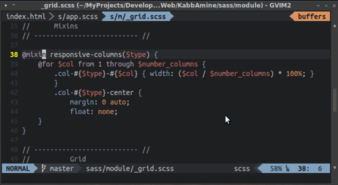
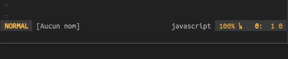
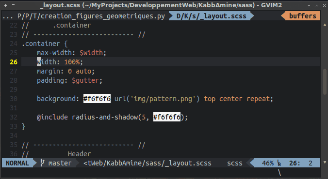

Zeavim - Zeal for Vim
=====================

[Description](#description) | [Installation](#description) | [Usage](#usage) | [Mapping](#mapping) | [Commands](#commands) | [Customization](#customization) | [Notes](#notes)

Description <a id="description"></a>
-------------

Zeavim allows to use [Zeal](http://zealdocs.org) documentation browser directly from [Vim](http://vim.org).

This plugin works on GNU/Linux and Windows.


Installation <a id="installation"></a>
-------------

To use zeavim, you need of course to have Zeal installed. Grab it from [here](http://zealdocs.org/download.html) and install it .

### Manual installation

Install the distributed files into Vim runtime directory which is usually `~/.vim/`, or `$HOME/vimfiles` on Windows.

### Using a plugin manager

And this is the best way, use a vim plugin manager:

| Plugin manager                                         | In vimrc                         | Installation command |
|--------------------------------------------------------|----------------------------------|----------------------|
| [Vim-plug](https://github.com/junegunn/vim-plug)       | `Plug 'KabbAmine/zeavim.vim'`      | `PlugInstall`          |
| [Vundle](https://github.com/gmarik/Vundle.vim)         | `Plugin 'KabbAmine/zeavim.vim'`    | `PluginInstall`        |
| [NeoBundle](https://github.com/Shougo/neobundle.vim)   | `NeoBundle 'KabbAmine/zeavim.vim'` | `NeoBundleInstall`     |


Usage <a id="usage"></a>
-----

They are 3 ways of using zeavim:

1.  `<leader>z` - Execute Zeal with the current word (Or visual selection in VISUAL mode) as a query and the file type as a docset **\***.
3.  `<leader>Z` (Note the capital *z*) - To specify a query in the current docset **\***.

  

4.  `<leader><leader>z` - To specify manually both query and docset (The docset name can be completed using `tab`, see [completion](#completion) for that.
).

  


**\*** If the file type is not defined, the plugin use file extension or the docset name specified by the command `Docset`.


Mapping <a id="mapping"></a>
-------

You can easily change the mapping keys of zeavim:

    nmap NEW_MAPPING <Plug>Zeavim			" <leader>z (NORMAL mode)
    vmap NEW_MAPPING <Plug>ZVVisSelection	" <leader>z (VISUAL mode)
    nmap NEW_MAPPING <Plug>ZVKeyword		" <leader>Z
    nmap NEW_MAPPING <Plug>ZVKeyDocset		" <leader><leader>z

If you don't want to use all those functionalities, you can [disable the default mapping](#disableMappings) and map only what you want.


Commands <a id="commands"></a>
-------

### Main commands

For those of you who prefer using commands, here they are:

    Zeavim  " Normal
    ZvV     " VISUAL mode
    ZvK     " Type query
    ZvKD    " Type docset and query

### Specify manually a docset

If you need a lazy way to specify a docset, you can use:

    Docset DOCSET_NAME

As an example, I'm working on a `scss` file but I want to get `compass` documentation when using Zeavim, so I just need to specify manually this docset:

    Docset compass

Then Zeavim **only for the current buffer** will use `compass` as a docset.

The docset name can be completed, for that see [completion](#completion).

To revert that and get zeavim working like usually, a simple `Docset` without argument is enough.




Customization <a id="customization"></a>
-------------

### Location of Zeal

By default zeavim looks for an executable named `zeal` on your system.  If that fails, zeavim assumes that *zeal* is located in `%ProgramFiles%/Zeal/zeal.exe` for Windows and `/usr/bin/zeal` for UNIX systems.
You can specify Zeal's location manually by adding in your vimrc:

    if has('win32') || has('win64')
        let g:zv_zeal_executable = "path\\to\\zeal.exe"
    else
        let g:zv_zeal_executable = "/usr/bin/zeal"
    endif

### Add file types

Zeavim generates the zeal docset name from the extension (Or the filetype vim option) of the current file, but if you need to add some other file types, you can create in your vimrc a dictionary with the extension or the vim file type as the key and the value as the docset name:

    let g:zv_added_files_type = {
        \ 'EXTENSION': 'DOCSET_NAME',
        \ 'FILE_TYPE': 'DOCSET_NAME',
        \ }

As an example (Those file types are already included into zeavim):

    let g:zv_added_files_type = {
        \ 'cpp': 'C++',
        \ 'js': 'Javascript',
        \ 'md': 'Markdown',
        \ 'mdown': 'Markdown',
        \ 'mkd': 'Markdown',
        \ 'scss': 'Sass',
        \ }

### Disable default mappings <a id="disableMappings"></a>

You can disable the default mappings by adding to your vimrc:

    let g:zv_disable_mapping = 1

### Docset name completion <a id="completion"></a>

When using `<leader><leader>z` or the command `Docset`, you can get a docset name completion with `Tab` (Or with `<C-d>` depending of your vim options).

There are 2 ways to enable that:

1. The docset names can be taken from your zeal's docset directory (The one specified in Zeal's options), just set the correct path in `g:zv_docsets_dir` in your vimrc (by default zeavim assumes that Zeal docsets are located in `%LOCALAPPDATA%\Local\Zeal\Zeal\docsets`, which expands into something like `C:\Users\you\AppData\Local\Zeal\Zeal\docsets`, for Windows and `~/.local/share/Zeal/Zeal/docsets` for UNIX systems):

	```
	if has('win32') || has('win64')
		let g:zv_docsets_dir = 'path\\to\\docsets\\directory\\'
	else
		let g:zv_docsets_dir = 'path/to/docsets/directory'
	endif
	```

2. If you want to enable completion just for a few docsets (Why not!), instead of `g:zv_docsets_dir` you can use `g:zv_lazy_docset_list`.

	There is an example:
	```
	let g:zv_lazy_docset_list = [ 'Compass', 'Bootstrap', 'Vagrant', 'Font Awesome' ]
	```

Notes <a id="notes"></a>
-----

Zeavim is my first vim plugin and it was created in the beginning for a personal use, so please feel free to report bug(s) and contact me if you want, I usually answer in 1-2 days.

Thank to [Jerzy Kozera](https://github.com/jkozera) for creating such wonderful open-source application.

Thank to Bram Moolenaar for creating the best piece of software in the world :D

Thank to you if you're using zeavim.
